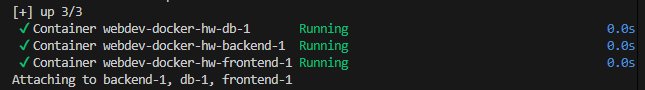
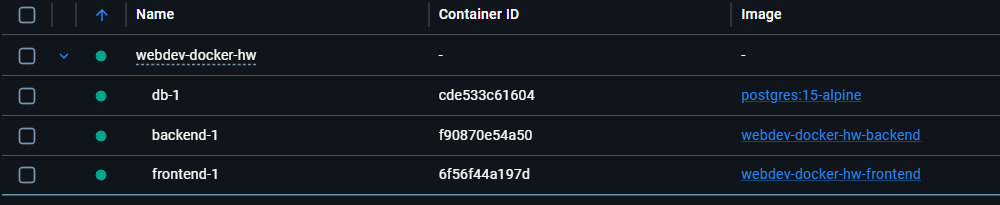
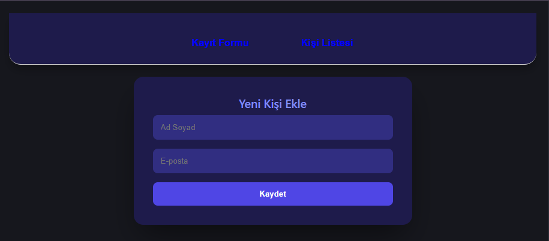
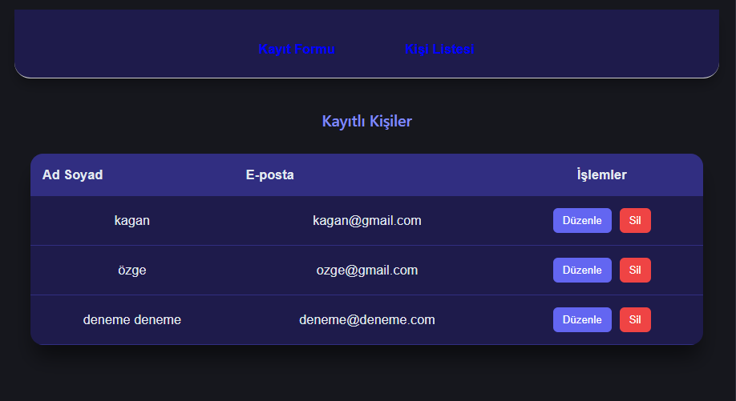
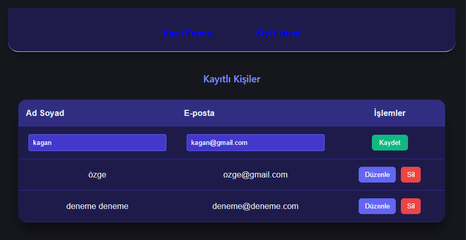
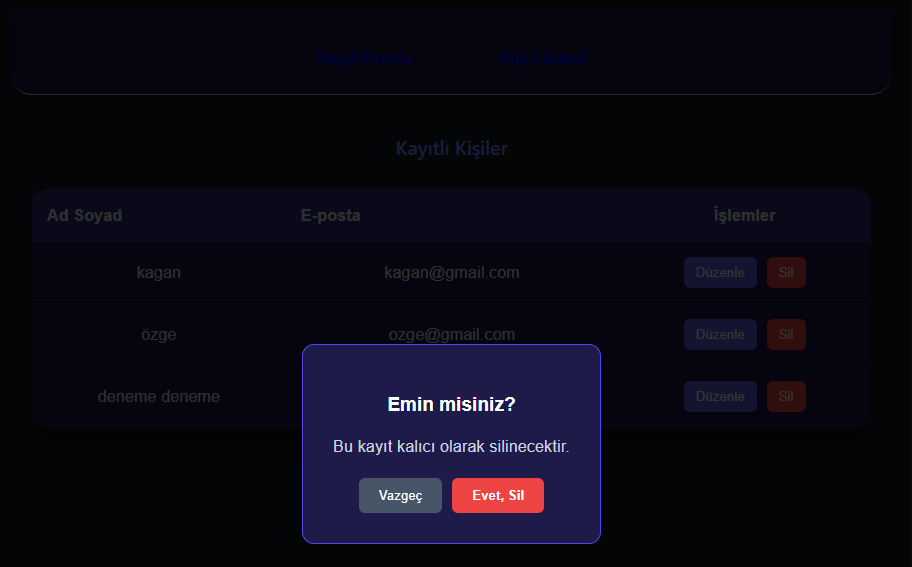
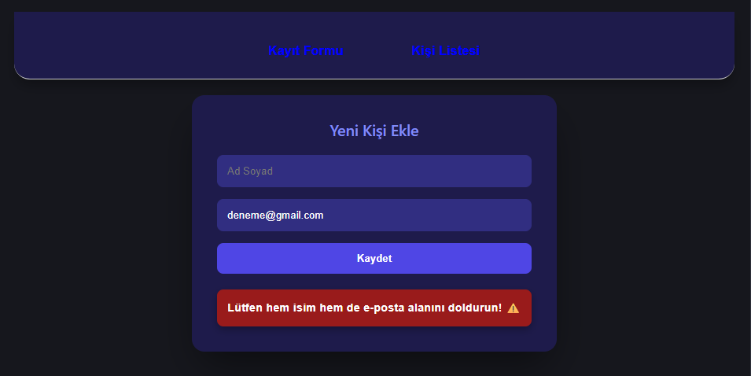
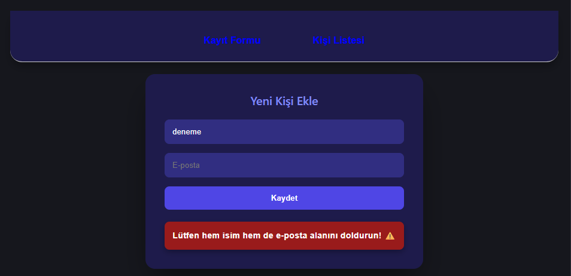

# 🚀 Full-Stack Personnel Management System

## Developer
* **Name:** Ümit Kağan Aslan

## 📖 Project Description
This is a robust, full-stack personnel management web application designed for high performance, data integrity, and a seamless user experience. The system features a modern **React** frontend with a custom-built, sophisticated **Dark Purple UI**. It is powered by a **Node.js/Express** backend API and utilizes **PostgreSQL** for persistent relational data storage.

The entire application architecture is fully containerized using **Docker** and **Docker Compose**, ensuring a frictionless, "one-click" deployment environment that remains consistent across all operating systems.

## ✨ Premium Features & Enhancements
Beyond the core CRUD operations, this project includes several advanced engineering and UI/UX features:
- **Single-Command Orchestration:** The Database, Backend API, and Frontend Client initialize and connect simultaneously via a single Docker Compose command.
- **Robust Full-Stack Validation:** - Frontend: Prevents empty submissions and trims whitespace before API calls.
  - Backend: Regex-based email formatting checks and PostgreSQL `UNIQUE` constraints prevent data duplication.
- **Smart Notification System:** Real-time, toast-style visual feedback for successful operations and specific error handling (e.g., catching `409 Conflict` for duplicate emails).
- **Custom Modal Architecture:** Standard browser alerts are replaced with a custom-built, theme-consistent Modal window for secure delete confirmations.
- **Inline Editing:** High-speed data updates directly within the table view, eliminating the need for page reloads or separate edit screens.

## 🛠️ Technologies Used
- **Frontend:** React (Vite), Axios, React Router, Custom CSS3 (Flexbox/Grid)
- **Backend:** Node.js, Express.js
- **Database:** PostgreSQL 15 (Alpine)
- **Infrastructure:** Docker, Docker Compose

## 🚀 Setup and Execution

### Prerequisites
- **Docker Desktop** installed and running.
- **Git** installed on your local machine.

### Installation
1. Make sure Docker Desktop is installed and running.

2. Clone the repository:

3. Start the application:
   
    docker compose up --build

## Accessing the System:

Frontend UI: http://localhost:5173

Backend API: http://localhost:5000/api/people

Database Port: 5432

## 📡 API Endpoint Documentation
Base URL: http://localhost:5000/api

| HTTP Method | Endpoint | CRUD Operation | Description | Status Codes |
| :--- | :--- | :--- | :--- | :--- |
| **POST** | `/people` | Create | Registers a new personnel record. | 201 (Created), 400 (Bad Req), 409 (Conflict) |
| **GET** | `/people` | Read | Retrieves a list of all personnel. | 200 (OK), 500 (Server Error) |
| **PUT** | `/people/:id` | Update | Modifies an existing personnel record. | 200 (OK), 400 (Bad Req), 500 (Error) |
| **DELETE** | `/people/:id` | Delete | Removes a record from the database. | 200 (OK), 500 (Server Error) |

## 📸 Ekran Görüntüleri (Screenshots)

### 1. Docker Service Status

### 2. Registration Form (Create Screen)

### 3. Personnel List 

### 4. Edit Operation (Inline)

### 5. Delete Operation 

### 6. Empty Name Field Error

### 7. Empty E-mail Field Error

### 8. Invalid E-mail Error
